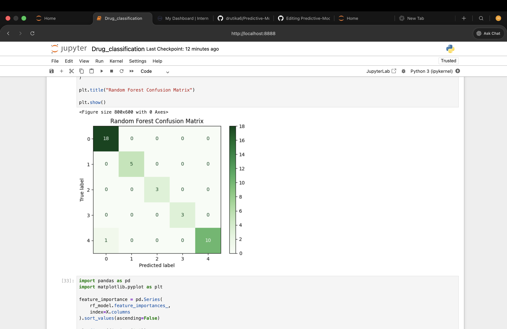
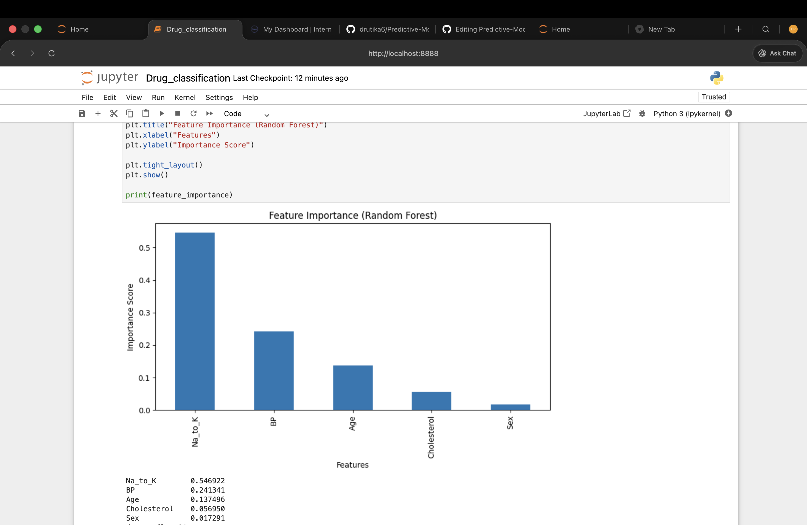
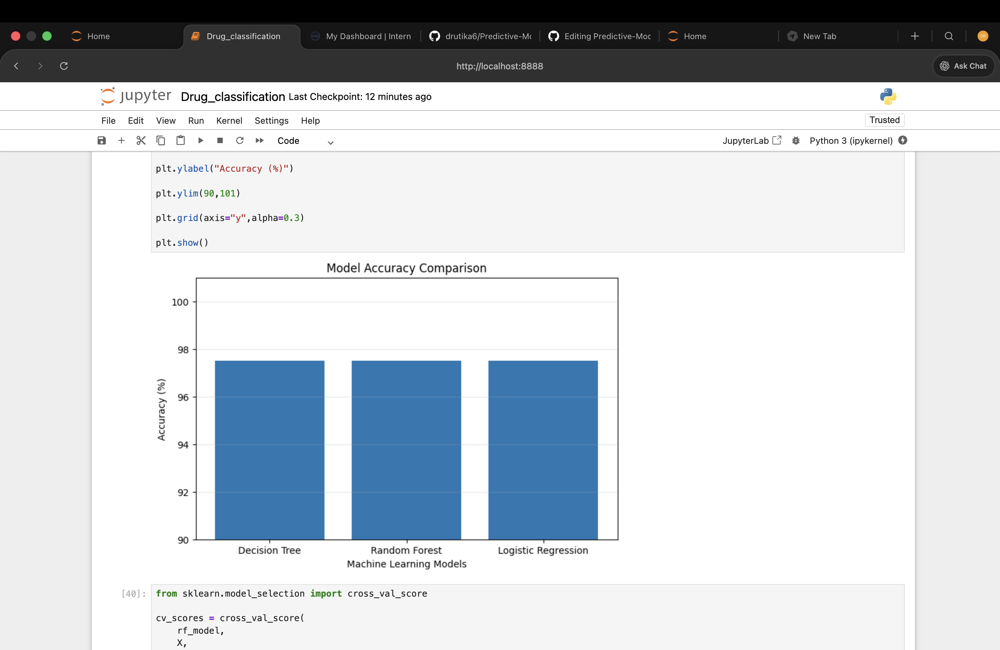

# Predictive Modeling for Drug Classification

> A Machine Learning project that predicts the appropriate drug type for a patient using clinical attributes. This project demonstrates the complete Machine Learning workflow—from data preprocessing and exploratory analysis to model training, evaluation, and performance comparison.

---

##  Project Overview

Drug prescription is a critical decision that depends on several patient characteristics. Incorrect medication selection may reduce treatment effectiveness and increase health risks.

This project applies supervised Machine Learning algorithms to classify the most suitable drug based on patient medical information. Multiple models are trained and evaluated to identify the best-performing classifier for accurate drug prediction.

---

##  Objectives

- Develop an intelligent drug classification model
- Perform data preprocessing and feature analysis
- Train multiple Machine Learning algorithms
- Compare model performance using evaluation metrics
- Visualize feature importance and confusion matrices
- Identify the most accurate prediction model

---

#  Dataset

The dataset contains medical information collected from patients.

| Feature | Description |
|----------|-------------|
| Age | Patient's Age |
| Sex | Gender |
| BP | Blood Pressure |
| Cholesterol | Cholesterol Level |
| Na_to_K | Sodium-to-Potassium Ratio |

###  Target Variable

**Drug Type**

The goal of the model is to predict the correct drug category based on the above patient attributes.

---

#  Technologies Used

- Python
- Jupyter Notebook
- Pandas
- NumPy
- Matplotlib
- Scikit-learn
- Joblib

---

#  Machine Learning Models

The following classification algorithms were implemented and compared:

- Decision Tree Classifier
- Random Forest Classifier
- Logistic Regression

---

#  Model Performance

##  Best Performing Model

**Random Forest Classifier**

**Accuracy: 97.50%**

The Random Forest model achieved the highest prediction accuracy among all implemented algorithms while maintaining excellent generalization performance.

---

#  Project Structure

```text
Predictive-Modeling-Drug-Classification/
│
├── data/
│   └── drug200.csv
│
├── images/
│   ├── confusion matrix.png
│   ├── Feature importance.png
│   └── model accuracy comparison.png
│
├── models/
│   └── random_forest_model.pkl
│
├── notebook/
│   └── Drug_classification.ipynb
│
├── requirements.txt
├── README.md
└── .gitignore
```

---

#  Project Results

## Confusion Matrix



---

## Feature Importance



---

## Model Accuracy Comparison



---

#  Key Achievements

- Successfully built an end-to-end Machine Learning classification project.
- Compared multiple classification algorithms.
- Achieved **97.50% prediction accuracy** using Random Forest.
- Generated confusion matrix for performance evaluation.
- Identified the most influential medical features.
- Saved the trained model for future predictions.

---

#  Future Enhancements

- Develop a Streamlit Web Application
- Deploy the model on the cloud
- Integrate Flask/FastAPI REST APIs
- Hyperparameter Optimization
- Cross Validation
- Real-time Drug Prediction Interface

---

#  Installation

Clone the repository

```bash
git clone https://github.com/drutika6/Predictive-Modeling-Drug-Classification.git
```

Navigate to the project folder

```bash
cd Predictive-Modeling-Drug-Classification
```

Install dependencies

```bash
pip install -r requirements.txt
```

Launch Jupyter Notebook

```bash
jupyter notebook
```

Open

```
notebook/Drug_classification.ipynb
```

---

#  Conclusion

This project demonstrates how Machine Learning can support healthcare decision-making by predicting appropriate drug categories using patient clinical information. It highlights the complete ML pipeline, including preprocessing, model development, evaluation, visualization, and model comparison.

---

#  Author

**Drutika**

GitHub: https://github.com/drutika6

---

⭐ If you found this project useful, consider giving this repository a **Star** on GitHub.

